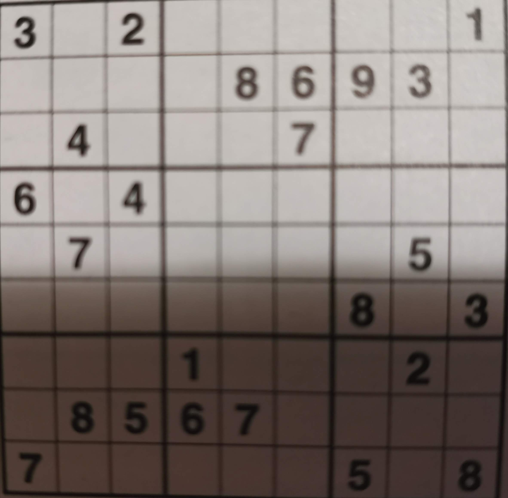

# sudoku-solver-ocr-experiment

[DEMO](https://albertodeago.github.io/sudoku-solver-ocr/dist/)

This project was an experiment, I wanted to see if it was "possible" to create a web app with cam functionality, 
you point the camera towards a sudoku, the app "scans" it, read the numbers and the empty cells and then it resolves it.

**Outcome**
The algorithm to solve the sudoku is easier than expected, I implemented a solver (brute-force with backtracking) in like 1 hour.  
Reading the image was instead an harder challenge than expected.
First surfing the web I found out that it's possible and "relatively easy" using [opencv.js](https://docs.opencv.org/3.4/d5/d10/tutorial_js_root.html) and [tensorflow.js](https://www.tensorflow.org/js). But I'm not a machine-learning expert and I didn't want to dive deep with those technologies. If you are interested you can check [this app](https://github.com/taylorjg/sudoku-buster) that works with those tools.  
So I decided to try a different and more imperative approach. Scan the image and then read the numbers via OCR, [tesseract.js](https://tesseract.projectnaptha.com/) seemed perfect for this job.  
After some tries I realize that it was not as easy as I anticipated. Giving an image like this 


as input to tesseract.js will output something like

6 3 0 0 0 1 1 11 1  
6 11 111 7 4 5 11 1 1  

and so on...  

I guessed that the grid was causing a lot of problems, probably all the lines are causing tesseract to read random numbers (especially a lot of "one").  
So my next step was to try to get the image and try to get rid of all the lines by splitting the original image in 81 small images (trying to get smaller squares to get only the numbers without the grid lines) and then give those 81 images as input to tesseract.js.
Using a sudoku image from online (so not a photo but a perfect image of a sudoku) like this


the output was great:

5 3 0 0 7 0 0 0 0  
6 0 0 1 9 5 0 0 0  
0 9 8 0 0 0 0 6 0  
8 0 0 0 6 0 0 0 3  
4 0 0 8 0 3 0 0 1  
7 0 0 0 2 0 0 0 6  
0 6 0 0 0 0 2 8 0  
0 0 0 4 1 9 0 0 5  
0 0 0 0 8 0 0 7 9  

and given as an input to my solver this is the output

5 3 4 6 7 8 9 1 2  
6 7 2 1 9 5 3 4 8  
1 9 8 3 4 2 5 6 7  
8 5 9 7 6 1 4 2 3  
4 2 6 8 5 3 7 9 1  
7 1 3 9 2 4 8 5 6  
9 6 1 5 3 7 2 8 4  
2 8 7 4 1 9 6 3 5  
3 4 5 2 8 6 1 7 9  

The issues start arising again when I tried to use real images, within the app I added the functionality to take a picture and again random results started.  
Given



tesseract output was similar to the first attempts even if the grid is not considered because I split the big images in smaller ones.  
I think that maybe it's because of picture noise or shadows, so I tried to boost up brightness and contrast of the small images but the result is still the same.  
I tried also with better picture with less noise, without shadows and on focus but the output was the same.  

Stopped the exploration at this point.
It was a funny experiment but I think that "reading" images is possible (with a certain reliability) only with AI tools.

I removed the video capture part because it was too unreliable, you can check the app [here](https://albertodeago.github.io/sudoku-solver-ocr/dist/)


## build

Use this command to push dist to gh-pages
```
git subtree push --prefix dist origin gh-pages
```